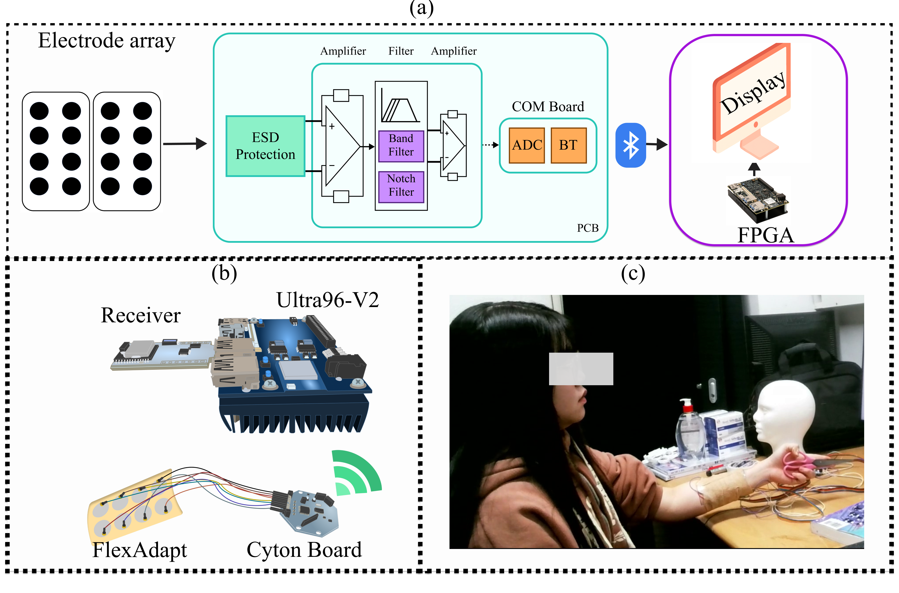

# Adaptive model updates for motor-intent decoding combined with flexible surface electromyography sensor grid

</div>

<div align="center">
  
</div> 


## Table of Contents
- [Usage](#usage)
  - [Installation and Setup](#installation-and-setup)
  - [Datasets](#datasets)
- [Offline Training](#offline)
  - [Pre-Training](#step1)
  - [Meta-Learning](#step2)
  - [Knowledge-Distillation](#step3)
- [On-device AdaptiveEdge](#online)


# Usage

<h2 id="installation">🛠 Installation</h2>

1. Clone the repo:
   ```bash
   git clone https://github.com/deremustapha/AdpativeEdge

2. Install dependencies:
   ```bash
   pip install -r requirements.txt
